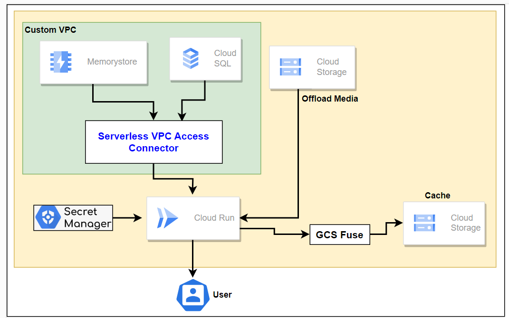

# Highly Available Wordpress on GCP CloudRun

## Architecture
<kbd>
  
</kbd>

## Developer
Janarthanan Kugathasan

## Method

- Upload the folder to cloudshell
- Switch to the directory
- Fill the required values in terraform.tfvars
- To create the resources
```terraform
terraform init
terraform plan
terraform apply -auto-approve
```
